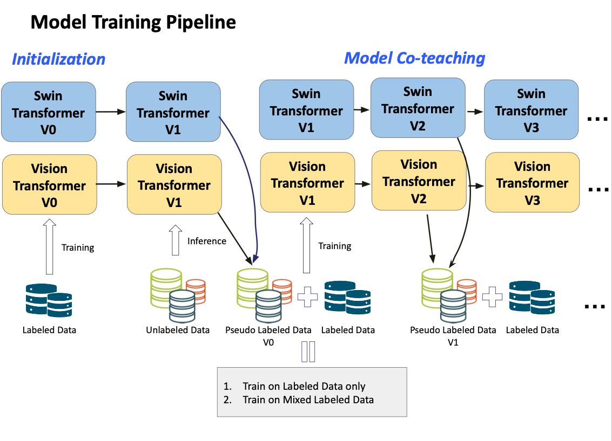

# Fine-Grained Semi-Supervised Classification

A PyTorch implementation of **Model Co-teaching** for semi-supervised fine-grained image classification. This project uses dual Vision Transformers (Swin Transformer + ViT) with dynamic pseudo-labeling to achieve **93.84% accuracy** on a 135-class fine-grained dataset.

## Overview

This project addresses the challenge of fine-grained classification with limited labeled data by leveraging:
- **Dual-model co-teaching**: Two different architectures (Swin-B and ViT-B/16) collaboratively generate pseudo-labels
- **Dynamic confidence thresholding**: Gradually relaxing the pseudo-label threshold during training
- **Semi-supervised learning**: Combining labeled data with high-confidence pseudo-labeled data

### Dataset
- **Training**: 9,854 labeled images + 22,995 unlabeled images
- **Testing**: 8,213 images
- **Classes**: 135 fine-grained categories (15 plants + 120 dog breeds)

## Model Architecture



### Training Pipeline

1. **Initialization**: Train both models on labeled data only
2. **Pseudo-label Generation**: Both models jointly predict on unlabeled data; only high-confidence predictions (above threshold) become pseudo-labels
3. **Merged Training**: Retrain models on combined labeled + pseudo-labeled data
4. **Dynamic Threshold**: Confidence threshold decreases from 0.8 to 0.5 across epochs

## Installation

```bash
git clone https://github.com/yikedabaicaimuuuu/fine-grained-ssl.git
cd fine-grained-ssl
pip install -r requirements.txt
```

## Usage

### Training

```bash
python train.py \
    --train-labeled-dir /path/to/train/labeled \
    --train-label-file /path/to/train_labeled.csv \
    --unlabeled-dir /path/to/train/unlabeled \
    --test-dir /path/to/test \
    --output-file predictions.csv \
    --epochs 10 \
    --batch-size 256
```

### Key Arguments

| Argument | Default | Description |
|----------|---------|-------------|
| `--num-classes` | 135 | Number of classification classes |
| `--batch-size` | 256 | Training batch size |
| `--epochs` | 10 | Number of co-teaching iterations |
| `--lr` | 1e-4 | Learning rate |
| `--initial-threshold` | 0.8 | Initial pseudo-label confidence threshold |
| `--threshold-decay` | 0.02 | Threshold decay per epoch |

## Project Structure

```
fine-grained-ssl/
├── assets/
│   └── pipeline.png    # Training pipeline diagram
├── src/
│   ├── __init__.py
│   ├── dataset.py      # Custom dataset class
│   ├── transforms.py   # Data augmentation
│   ├── models.py       # Swin-B and ViT model creation
│   └── trainer.py      # Training and pseudo-labeling utilities
├── train.py            # Main training script
├── code.py             # Original single-file implementation
├── requirements.txt
└── README.md
```

## Technical Details

### Models
- **Swin Transformer Base**: Pretrained on ImageNet, 88M parameters
- **ViT-B/16**: Pretrained on ImageNet, 86M parameters

### Training Configuration
- **Optimizer**: AdamW with weight decay 1e-4
- **Scheduler**: Cosine Annealing with Warm Restarts (T_0=10, T_mult=2)
- **Loss**: Cross-Entropy with label smoothing (0.1) and class weights
- **Mixed Precision**: FP16 training with GradScaler

### Data Augmentation
- Random crop and resize (256×256)
- Random horizontal flip
- Color jitter (brightness, contrast, saturation, hue)
- Random rotation (±15°)

## Results

| Method | Accuracy |
|--------|----------|
| Baseline (labeled only) | ~85% |
| **Model Co-teaching (Ours)** | **93.84%** |

## Citation

This project was developed as part of the CSE244A course at UC Santa Cruz.

```bibtex
@misc{fine-grained-ssl,
  title={Model Co-teaching for Semi-supervised Fine-grained Classification},
  author={Liu, Yanqing and Li, Zhonghui and Tu, Haoqin},
  year={2024},
  institution={UC Santa Cruz}
}
```

## License

MIT License
